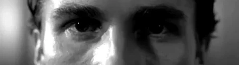

# What Brought You Here?

 

Maybe you came looking for a résumé: a stack of technologies, a row of repositories, something to prove I am good at what I do.

You can find that elsewhere, if that is what you need. This page is not that.

What follows is closer to what actually occupies my mind on most days than anything I have built.

There was a time when I thought growing up meant finding out who I was.

I remember once looking at a photograph of myself from years earlier, and needing a moment before the face in it felt like mine.

That is what we are taught to believe. We spend years collecting names for ourselves: a son, a friend, a child, a stranger, a success, a failure, as if somewhere beneath all those names there is a final version of ourselves waiting to be discovered.

I am no longer sure that such a person exists.

Perhaps we do not spend our lives discovering who we are. Perhaps we spend them creating someone who did not exist before. Every decision leaves something behind. Every person we meet changes the shape of us, sometimes so quietly that we only notice years later. Things we once believed become things we question. Things we once questioned become things we believe. And sometimes, the person we were certain we would become is simply someone we never became at all.

Maybe that is not failure.

Maybe becoming is supposed to be unfinished.

The older I become, the more strange the idea of certainty feels. We want answers because answers make the world smaller and easier to carry. We give things names, draw boundaries around them, decide what they are, and then convince ourselves that we understand them. But the world rarely seems to respect the boundaries we draw around it. The more closely I look at people, nature, society, conflict, life and death, the more I notice that things which appear completely different often seem to follow the same quiet patterns underneath.

Understanding may not be about finding the final explanation. Perhaps it is only learning to see the connections between things without pretending that we have explained them completely.

This has also changed the way I think about freedom. We often imagine freedom as the absence of boundaries, as if to be free means to have no limits at all. But every life is surrounded by things we did not choose: the time in which we were born, the people around us, our bodies, our circumstances, the consequences of our decisions. If freedom can exist only in a world of constraints, then freedom was never the absence of boundaries. It is the space we create within them.

There are still many things I do not know.

I do not know whether a meaningful life is something we discover or something we give meaning to. I do not know whether freedom is something we possess or something we continuously negotiate with the world. I do not know whether knowledge brings us closer to truth, or merely teaches us how large our ignorance really is.

But I have started to become comfortable with not knowing.

There is something beautiful in being unfinished: in changing your mind, questioning what once seemed obvious, carrying contradictions without immediately trying to destroy one of them. Perhaps a life does not need a perfect conclusion to be a meaningful one.

We are temporary beings, moving through a world that existed long before us and will continue long after us. We leave behind traces: a sentence someone still remembers years later, a habit passed on without either of us noticing, something built that quietly outlives the reason we built it.

Maybe that is enough.

Maybe we are not here to arrive at some final version of ourselves.

Maybe we are simply here to keep becoming.

And for now, I think that is enough.

 

·

 

*— Nguyễn Văn Dưỡng —*

